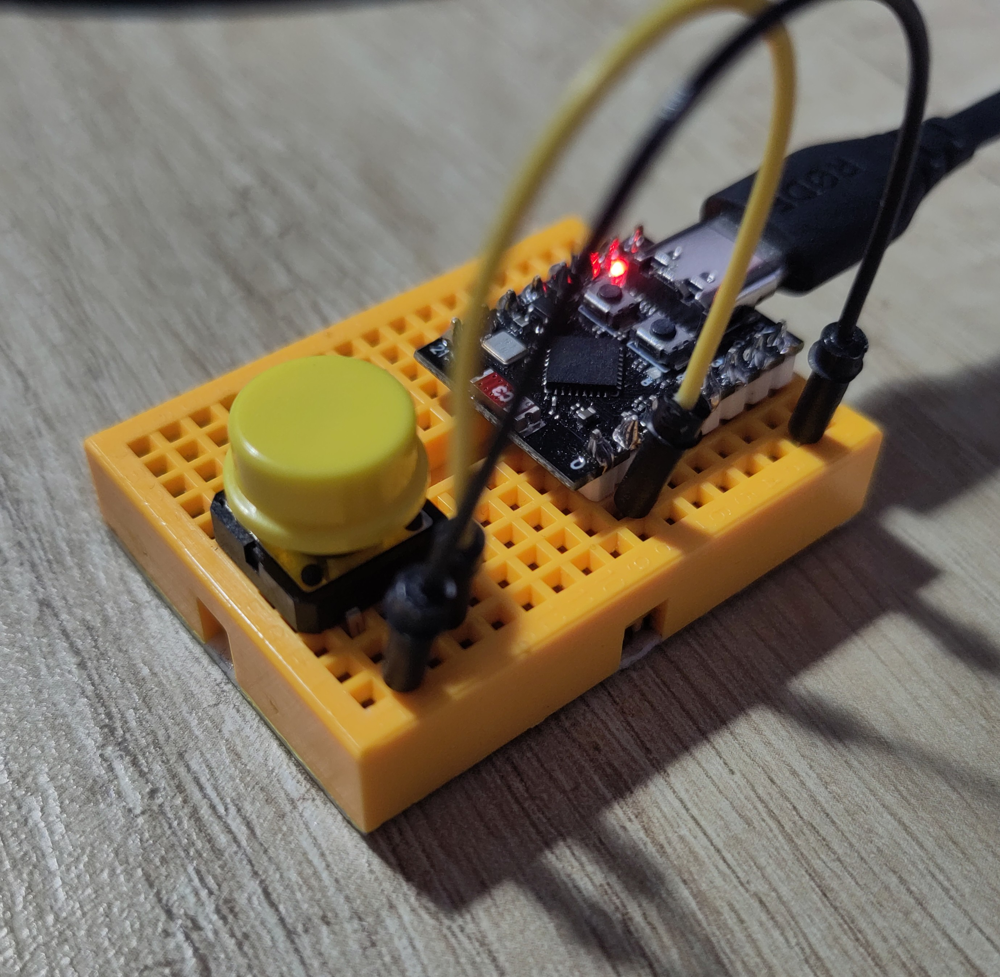
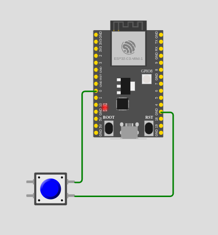

## Learning how to program `esp32c3` with Rust & IDF bindings

Using this little clone with typical the simplest push button. Only software debouncing used here, as it appears to work well enough for what I need.

- Generated from https://github.com/esp-rs/esp-idf-template
